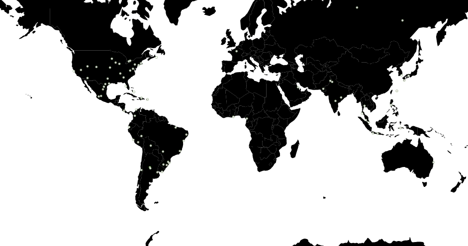

# Twitter realtime pipeline

This repository contains an example of Twitter realtime analysis pipeline.

* [High level design](#high-level-design)
* [Dependencies](#dependencies)
* [How so start](#how-to-start)
* [How to see the results](#how-to-see-the-results)
* [Twitter Source Job Description](#twitter-source-job-description)
* [Flink Sentiment Analysis Pipeline Description (including ML model)](#flink-sentiment-analysis-pipeline-description)
* [Flink Geo Aggregation Pipeline Description](#flink-geo-aggregation-pipeline-description)
* [UI Description](#ui)

### High level design


### Dependencies
- Kubernetes
- Helm
- Google Cloud SDK (optional to create a Kubernetes cluster)

## How to start 

### 0. Prerequisites
- Install [Google Cloud SDK](https://cloud.google.com/sdk/install) (optional)
- Install [kubectl](https://kubernetes.io/docs/tasks/tools/install-kubectl/)
- Install helm: `curl https://raw.githubusercontent.com/kubernetes/helm/master/scripts/get | bash`

### 1. Setup Twitter credentials
- Log in into Twitter 
- [Apply for a developer account](https://developer.twitter.com/en/apply)
- [Create an application](https://developer.twitter.com/en/apps/create)
- Set Keys and Tokens
    * `echo -n {CONSUMER_KEY} > k8s/.env/CONSUMER_KEY`
    * `echo -n {CONSUMER_SECRET} > k8s/.env/CONSUMER_SECRET`
    * `echo -n {TOKEN} > k8s/.env/TOKEN`
    * `echo -n {TOKEN_SECRET} > k8s/.env/TOKEN_SECRET`

### 2. Create and deploy kubernetes cluster
- `make cluster`  (this command will create Kubernetes cluster. Skip if you already have one)
- `make initialize` (this command installs `helm` and `secret` with Twitter credentials)
- wait for couple of minutes for helm to initialize
- `make infra` (this command installs kafka/cassandra/flink/es)
- wait until `kubectl pods` shows that all 3 instances of each cassandra and kafka are up and running
- `make start` (this command will start twitter source job, flink pipelines and ui)

## How to see the results:
- UI: `kubectl get service/ui-app-svc -o jsonpath='{.status.loadBalancer.ingress[0].ip}'` will give you ip and then open http://{ip}:8080
- Kibana: `kubectl get service/kibana-rest -o jsonpath='{.status.loadBalancer.ingress[0].ip}'` will give you ip and then open http://{ip}:5601
- Cassandra: `echo "select count(*) from ks.twitter_sentiment_analysis; exit" | kubectl exec -i cassandra-client cqlsh cassandra` 

## Twitter Source Job Description
Twitter Source job is pretty simple: it uses [Twitter's client library](https://github.com/twitter/hbc) to connect to [twitter realtime API](https://developer.twitter.com/en/docs/tweets/filter-realtime/api-reference/post-statuses-filter) and writes all received tweets into Kafka. 

## Flink Sentiment Analysis Pipeline Description
This pipeline performs a simple task - applies sentiment prediction model to every tweet. 
The model is probably the most interesting part of this pipeline. 

This is how this model is created (you can see this process in details [here](https://github.com/krinart/twitter-realtime-pipeline/blob/master/ml/Sentiment%20Analysis.ipynb)):
1. We need a dataset of texts with assigned sentiment - I took [Sentiment140](http://help.sentiment140.com/for-students/) 
2. We also need a set of pre-trained word embeddings - I took [Glove](https://nlp.stanford.edu/projects/glove/)
3. Using pre-trained word embeddings and dataset of texts with assigned sentiment we can train an [Xgboost](https://xgboost.readthedocs.io/en/latest/) classifier which predicts sentiment for the given word enbedding
4. Since the trained model is a Python object and we need to use it in JVM environment, I used [m2cgen](https://github.com/BayesWitnesses/m2cgen) library to generate Java code for the model (I'm also a co-author of this library)
5. The only thing left is to export word embeddings to use them in the flink pipeline
6. Now we can [apply this model](https://github.com/krinart/twitter-realtime-pipeline/blob/master/flink_pipeline/src/main/scala/flink_pipeline/ScoreTweetMap.scala#L11-L18) for every tweet in real time.

## Flink Geo Aggregation Pipeline Description
This pipeline aggregates tweets by geographical location as well as by 5 seconds intervals.
The output of this pipeline is the stream of messages in the following format:
```json
{
  "created": "2019-09-08 07:01:14.999 UTC",
  "coordinates": {"lon":43.20000076293945, "lat":43.20000076293945},
  "numberOfEvents": 4
}
```
Here are the steps we need to take in order to do such aggregation:
1. Deserialize json-formatted string representing single tweet into Scala object
2. Since we want to process tweets in real time, we need to use [EventTime](https://ci.apache.org/projects/flink/flink-docs-stable/dev/event_time.html), 
which in turn requires extracting watermarks from the stream of tweets. 
Since tweets might not arrive in order we need to accommodate for some lateness. 
After some experiments I've discovered that bounded lateness of 3.5 seconds provides the best trade off between the number of 
tweets arriving after the window has been closed and the number of open windows.
3. In order to group tweets by location and by time, following transformations [are performed](https://github.com/krinart/twitter-realtime-pipeline/blob/master/flink_pipeline/src/main/scala/flink_pipeline/utils/pipelines.scala#L48-L65):
    * Split the world's map into cells
    * Convert each tweet into (cellX, cellY) tuple
    * Apply time window of 5 seconds
    * Calculate the number of tweets per each window/cell
    * At this point we have a stream of ((cellX, cellY), numberOfEvents) tuples
    * Now all we need to do is to convert (cellX, cellY) to (lon, lat) and to add the window's timestamp to the final message
4. Serialize final message into JSON and push it into Kafka.

## UI Description

UI consists of 2 parts: Web Client written in JS connecting to NodeJS server using WebSockets.
The implementation of both of them is pretty straightforward:
- NodeJS server connects to Kafka at the startup
- When user opens the page in the browser, web client establishes WebSocket connection to the NodeJS server
- Server keeps a set of current WebSocket connections from the Web clients
- For every messages consumed from Kafka, Server writes it to every WebSocket connection.
- When WebSocket connection is closed, Server deletes it from the set of current connections. 

This is how ui looks like:


